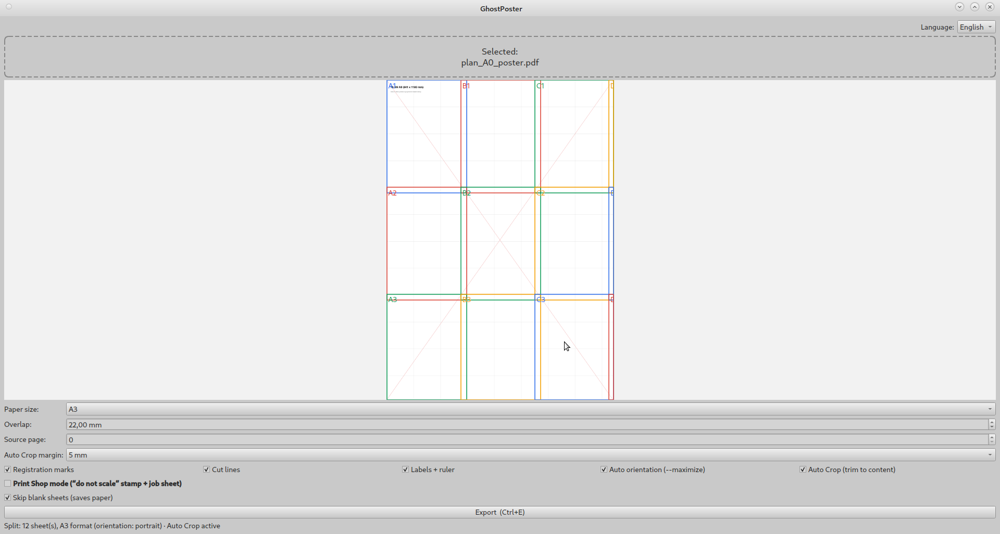
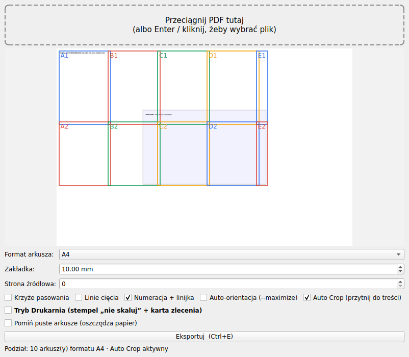
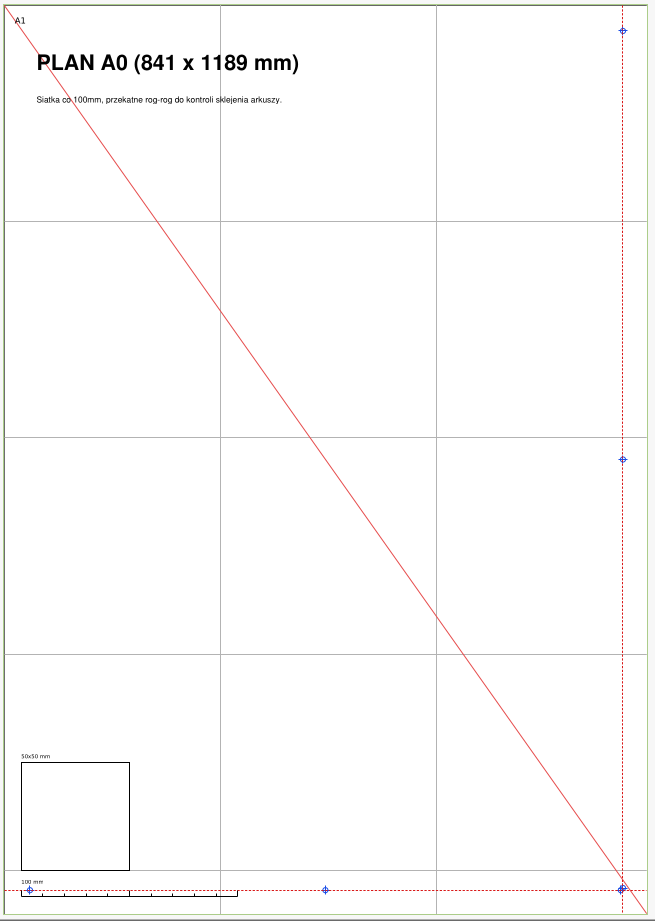

<p align="center">
  
</p>

<h1 align="center">GhostPoster</h1>

<p align="center">
<b>Open-Source PDF Tiling & Poster Printing Tool</b><br>
Split large PDF drawings into printable A-series, Letter, ANSI and ARCH pages while preserving an exact 100% scale.
</p>

<p align="center">
  <a href="https://github.com/nftomczain/GhostPoster/releases">
    
  </a>

  <a href="https://github.com/nftomczain/GhostPoster/actions">
    
  </a>

  

  

  
</p>


---


GhostPoster is an open-source PDF tiling application that converts large engineering drawings into printable pages for standard desktop printers.

> ### No plotter required.
>
> **No scaling.**
>
> **Just print and assemble.**

GhostPoster automatically splits large PDF drawings into multiple A-series, Letter, ANSI, ARCH and other supported paper sizes while preserving an exact **100% print scale**.

<p align="center">
  
</p>

Originally developed for **RC aircraft plans**, GhostPoster is equally useful for:

- ✈ RC aircraft plans (Flite Test, Experimental Airlines, DIY)
- 📐 CAD drawings
- 📄 Technical documentation
- 🖼 Posters
- 📘 Blueprints
- ⚙ CNC templates
- 🪚 Woodworking plans
- 🏗 Architecture drawings
- 🔨 DIY projects

Whether you're building an RC aircraft, printing a workshop template or assembling a full-size engineering drawing, GhostPoster ensures that every page is printed at the original scale.

---

# Screenshots

### Live Preview

<p align="center">
  
</p>

### Generated PDF

<p align="center">
  
</p>

## Why GhostPoster?

GhostPoster was created to solve problems that traditional poster printing tools don't address.

While most PDF viewers can split a document into multiple pages, GhostPoster is designed specifically for technical drawings, engineering plans and RC aircraft models.

| Feature | Adobe Acrobat Reader<br>Poster Mode | GhostPoster |
|:--------|:----------------------------------:|:-----------:|
| Basic poster printing | ✅ | ✅ |
| Exact 100% print scale | ✅ | ✅ |
| Smart Auto Crop | ❌ | ✅ |
| Automatic page orientation | ❌ | ✅ |
| Skip blank pages | ❌ | ✅ |
| Registration marks | ❌ | ✅ |
| Cut lines | ❌ | ✅ |
| Page labels | ❌ | ✅ |
| 100 mm calibration ruler | ❌ | ✅ |
| 50×50 mm calibration square | ❌ | ✅ |
| Print Shop mode | ❌ | ✅ |
| Live preview | ❌ | ✅ |
| GUI & CLI | ❌ | ✅ |
| Open Source | ❌ | ✅ |

GhostPoster isn't intended to replace a PDF viewer.

Instead, it focuses on one task—creating accurate, print-ready tiled PDFs for technical drawings while minimizing paper waste and preserving the original scale.

---
## Exact Scale

GhostPoster never rescales your drawing.

A 100 mm line in the source PDF remains exactly 100 mm after printing.

Perfect for engineering drawings, RC aircraft plans and CNC templates.

---

## Smart Auto Crop

Large white margins waste paper.

GhostPoster automatically detects the actual drawing area and removes unnecessary margins before calculating the page layout.

Result:

- fewer pages
- less paper
- less tape
- faster assembly

---

## Automatic Page Orientation

GhostPoster can automatically choose portrait or landscape orientation for the selected paper size to reduce the total number of printed sheets.

Scale is never changed.

Only the page orientation is optimized.

---

## Skip Blank Pages

Many PDF drawings contain large empty areas.

GhostPoster detects pages that would contain almost no printable content and can automatically skip them.

This significantly reduces paper consumption.

---

## Print Shop Mode

Designed for professional print shops.

Automatically adds:

- print instruction sheet
- "DO NOT SCALE" stamp
- PDF metadata

This minimizes printing mistakes.

---

## Cross Platform

GhostPoster runs on

- Linux

The project is continuously tested using GitHub Actions on all supported platforms.

---

# Installation

## Requirements

- Python **3.10** or newer (source installation)
- Linux, Windows or macOS

GhostPoster works completely offline and does not require any external services.

---

## Linux (AppImage)

Download the latest **GhostPoster-x86_64.AppImage** from the
[Releases](https://github.com/nftomczain/GhostPoster/releases) page.

Make it executable and run:

```bash
chmod +x GhostPoster-x86_64.AppImage
./GhostPoster-x86_64.AppImage
```

Optional integrity check:

```bash
sha256sum -c GhostPoster-x86_64.AppImage.sha256
```

---

## Build from source

### Clone the repository

```bash
git clone https://github.com/nftomczain/GhostPoster.git
cd GhostPoster
```

### Install CLI

```bash
pip install -e .
```

### Install GUI

```bash
pip install -e ".[gui]"
```

### Run

CLI

```bash
ghostposter input.pdf
```

GUI

```bash
ghostposter-gui
```

or

```bash
python -m ghostposter.gui
```
```

---

# Quick Start

Convert a large PDF drawing into printable A3 pages:

```bash
ghostposter plan.pdf \
    --paper A3 \
    --overlap 15 \
    --maximize \
    --auto-crop \
    --skip-blank \
    --marks \
    --cutlines \
    --labels \
    --output plan_A3.pdf
```

GhostPoster will automatically:

- detect the drawing area
- remove unnecessary white margins
- choose the best page orientation
- skip nearly empty pages
- generate registration marks
- add cut lines
- preserve an exact **100% scale**

Result:

```
plan_A3.pdf
```

ready for printing.

---

# Graphical User Interface

GhostPoster includes a modern desktop interface built with **PySide6**.


The GUI is designed to make large-format printing as simple as possible.

Features include:

- Live page grid preview
- Instant page count
- Drag & Drop PDF support
- Export progress bar
- Automatic settings persistence
- Keyboard shortcuts
- Screen reader accessibility

---

## Live Preview

The preview updates immediately after changing:

- paper size
- overlap
- Auto Crop
- Auto Orientation
- Skip Blank Pages

No export is required to see the final layout.

---

## Drag & Drop

Simply drag a PDF file into the window.

GhostPoster automatically loads the document and calculates the page layout.

---

## Keyboard Shortcuts

| Shortcut | Action |
|-----------|--------|
| **Ctrl + O** | Open PDF |
| **Ctrl + E** | Export PDF |
| **Ctrl + Q** | Quit |

---

## Accessibility

GhostPoster is designed to work well with screen readers.

Every interactive control provides an accessible name.

The application can be operated entirely from the keyboard.

---

# Command Line Interface

GhostPoster can also be used from scripts or the terminal.

Basic example:

```bash
ghostposter drawing.pdf --paper A4
```

---

## Command Line Options

| Option | Description | Default |
|----------|-------------|---------|
| `--paper` | Output paper size | `A4` |
| `--overlap` | Overlap between pages (mm) | `10` |
| `--page` | Source PDF page | `0` |
| `--output` | Output filename | `<input>_tiled.pdf` |
| `--maximize` | Automatically choose portrait/landscape orientation | disabled |
| `--auto-crop` | Crop to actual drawing content before tiling | disabled |
| `--skip-blank` | Automatically skip blank pages | disabled |
| `--keep-blank` | Keep blank pages | disabled |
| `--marks` | Registration marks | disabled |
| `--cutlines` | Cut lines | disabled |
| `--labels` | Page labels and calibration marks | disabled |
| `--print-shop` | Print Shop mode | disabled |

---

## Print Shop Mode

Designed for professional printing services.

Adds:

- Print instruction sheet
- "DO NOT SCALE" stamp
- PDF metadata

This helps avoid accidental scaling during printing.

---

## Auto Crop

Large engineering drawings often contain significant white margins.

GhostPoster detects the actual drawing content, adds a configurable safety margin and performs page tiling only within the useful drawing area.

Benefits:

- fewer pages
- less paper
- less tape
- faster assembly

---

## Skip Blank Pages

Some drawings occupy only part of the page.

GhostPoster renders each output tile at low resolution and estimates its coverage.

Nearly empty pages can be:

- removed automatically
- kept
- confirmed interactively

This saves both paper and printing time.

---

## Auto Orientation

GhostPoster compares portrait and landscape layouts.

The orientation producing fewer pages is selected automatically.

The original drawing scale always remains **100%**.

---
# Examples

The example PDFs included with this project are synthetic test files created specifically for GhostPoster.

They are intended for demonstration and automated testing purposes.

| File | Purpose |
|------|---------|
| `plan_A0_poster.pdf` | Large ISO A0 drawing |
| `plan_large_margins.pdf` | Auto Crop demonstration |
| `plan_multipage.pdf` | Multi-page document |
| `plan_wide_strip.pdf` | Auto Orientation (`--maximize`) |
| `test_plan.pdf` | General regression testing |

Example:

```bash
ghostposter examples/plan_large_margins.pdf \
    --paper A4 \
    --auto-crop \
    --output result.pdf
```

---

# Project Structure

```
GhostPoster/
│
├── ghostposter/
│   ├── blank.py
│   ├── cli.py
│   ├── config.py
│   ├── crop.py
│   ├── fonts.py
│   ├── geometry.py
│   ├── gui.py
│   ├── marks.py
│   ├── paper.py
│   ├── tiler.py
│   ├── utils.py
│   ├── writer.py
│   └── __main__.py
│
├── tests/
├── examples/
├── docs/
├── scripts/
├── .github/
├── pyproject.toml
└── README.md
```

---

## Module Overview

| Module | Description |
|---------|-------------|
| `geometry.py` | Page layout calculation |
| `crop.py` | Smart Auto Crop |
| `blank.py` | Blank page detection |
| `writer.py` | PDF generation |
| `marks.py` | Registration marks, cut lines and labels |
| `paper.py` | Paper size definitions |
| `gui.py` | PySide6 graphical interface |
| `cli.py` | Command-line interface |

---

# Building

Create a distributable package:

```bash
python -m build
```

Generated files will be placed in:

```
dist/
```

---

# Development Installation

```bash
git clone https://github.com/nftomczain/GhostPoster.git

cd GhostPoster

python -m venv .venv

source .venv/bin/activate      # Linux/macOS

# or

.venv\Scripts\activate         # Windows

pip install -e ".[gui]"
```

---

# Running Tests

GhostPoster uses:

- pytest
- Ruff
- Black

Run all tests:

```bash
pytest
```

Lint:

```bash
ruff check
```

Formatting:

```bash
black --check .
```

---

# Continuous Integration

Every push and pull request is automatically verified using GitHub Actions.

The CI pipeline runs:

- Ruff
- Black
- Pytest
- Package build

Supported platforms:

- Linux
- Windows
- macOS

Supported Python versions:

- 3.10
- 3.11
- 3.12

---

# FAQ

## Does GhostPoster change the drawing scale?

No.

GhostPoster always preserves the original **100% scale**.

---

## Can I print RC aircraft plans?

Yes.

GhostPoster was originally created for printing Flite Test and other RC aircraft plans.

---

## Does GhostPoster require Internet access?

No.

Everything runs locally.

No cloud services are used.

---

## Can I use it commercially?

Yes.

GhostPoster is released under the MIT License.

---

## Does GhostPoster modify the original PDF?

No.

GhostPoster always creates a new output PDF.
The original document is never modified.

---

## Does GhostPoster rasterize my drawing?

No.

Vector content remains vector whenever possible, preserving print quality.

---

# Roadmap

## v1.0 — First Stable Release ✅

- Core PDF tiling engine
- Live Preview
- GUI & CLI
- Smart Auto Crop
- Automatic Page Orientation
- Skip Blank Pages
- Print Shop Mode
- Registration Marks
- Cross-platform support
- GitHub Actions CI

---

## v1.1

- Smooth zoom
- Mouse panning
- Mini-map (Navigator)
- Export selected pages only
- Better preview performance

---

## v1.2

- Adjustable Auto Crop margin
- Custom registration marks
- Custom cut line styles
- User-defined paper sizes
- Printer profiles

---

## v1.3

- SVG export
- DXF export
- Intelligent page nesting
- Duplex / Booklet support
- Improved page optimization

---

## Core Features

- 🎯 Exact 100% print scale
- ✂ Smart Auto Crop
- 📄 Automatic Page Orientation
- 🗑 Skip Blank Pages
- ✂ Cut Lines
- ✚ Registration Marks
- 📐 Calibration Marks
- 🖥 Live Preview
- 🏭 Print Shop Mode
- 🌍 Cross Platform

---

# Contributing

Contributions are welcome.

If you have found a bug or would like to request a new feature:

1. Open an Issue.
2. Describe the problem.
3. Provide a sample PDF whenever possible.

Pull Requests are always welcome.

Please ensure that:

- all tests pass
- Ruff reports no issues
- Black formatting is preserved

Please discuss larger changes in an Issue before opening a Pull Request.

---

# License

GhostPoster is released under the **MIT License**.

See the **LICENSE** file for details.

---

# Acknowledgements

GhostPoster was originally developed to simplify printing full-scale RC aircraft plans on standard desktop printers.

Special thanks to everyone who tested GhostPoster during its early development and helped improve the project by reporting bugs and suggesting new features.

---

<p align="center">

Made with ❤️ in Poland

for the RC, Maker and Open Source communities.

</p>